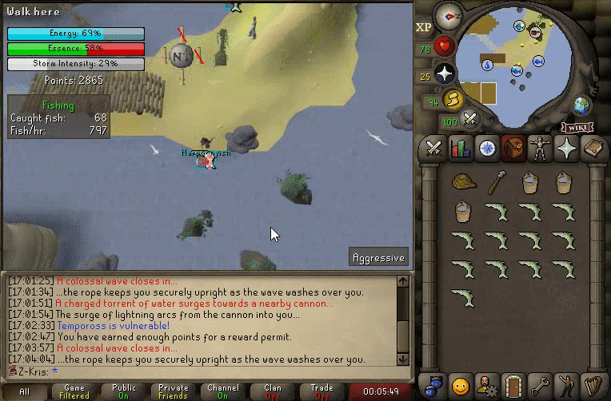

# Exact Move Mask
{: .no_toc }

The exact move mask is used to inform the client of precise movements for players and NPCs.

---

## Table of contents
{: .no_toc .text-delta }

- TOC
{:toc}

---

## Supported Variables

The exact move mask allows customizing entity movement by allowing the server to define the exact direction
and timings for the movement.
Below is a breakdown of the different variables that the server defines:
- Two coordinates, both of which define both deltas.
  - Delta x.
  - Delta z.
  - Each of the four deltas are read as signed bytes, meaning the minimum value of -128, and the maximum 127(inclusive).
- Two variables of [client ticks](../variables/client-tick.md#client-tick) which define the start of both of the movements.
  - The first variable defines the exact client tick at which the entity will arrive at the first specified coordinate.
  - The second variable defines the exact client tick at which the entity will arrive at the second specified coordinate.
  Note that the second variable cannot be smaller than, or equal to the first.
  - Both of the time variables are read as an unsigned short, giving a value range of 0 to 65,535(inclusive) [client ticks](../variables/client-tick.md#client-tick).
- The [direction](../variables/entity-direction.md#entity-direction) that the entity will be facing throughout the whole duration of the exact move. Note that the direction cannot differ
in the second part of the movement.
  - The direction variable is written as an unsigned short, giving it a value range of 0 to 65,535(inclusive).
  Although the theoretical maximum is 65,535, the client will always use the bitwise-and operator to limit the maximum value
  to 2,047.

## Use Cases

Exact move can primarily be seen used for agility shortcuts and obstacles.
An example scenario of a player using exact move can be seen during
[the crossing of the underground tunnel](#the-crossing-of-the-underground-tunnel)
connecting the [Grand Exchange](https://oldschool.runescape.wiki/w/Grand_Exchange) and [Edgeville](https://oldschool.runescape.wiki/w/Edgeville).

In addition to players using exact move, this can also be seen for NPCs. Although the feature is relatively new
at this point, as of writing this document, exact move has been used for two NPCs - [The Nightmare](https://oldschool.runescape.wiki/w/The_Nightmare)
and [the clouds at Tempoross](https://oldschool.runescape.wiki/w/Tempoross).
An example scenario of NPC exact move can be seen in the [clouds moving across land](#the-clouds-at-tempoross) gif.

## Extra Information

The exact move mask for players requires the use of the [exact move speed](move-speed-mask.md#move-speed-types) in order to function
correctly. It is important not to use the [instant move speed](move-speed-mask.md#move-speed-types) for exact move,
as that causes the client to jump to the first coordinate defined in this mask, rather than smoothly move to it.

## Client Code

Below is the refactored version of the client code behind the exact move mask.
Note that for the purposes of this demonstration, only the lines that affect the buffer have been kept.
There are minor differences in how the client uses the given data, depending on whether it's updating a
player or an NPC.

*All the buffer methods shown below can have different transformations applied on them, depending on the
revision of the client. For the purposes of the demonstration, all transformations have been excluded.*

```java
entity.exactMoveFirstDeltaX = buffer.readByte();
entity.exactMoveFirstDeltaY = buffer.readByte();
entity.exactMoveSecondDeltaX = buffer.readByte();
entity.exactMoveSecondDeltaY = buffer.readByte();
entity.exactMoveFirstTimespan = buffer.readUnsignedShort() + Client.gameCycle;
entity.exactMoveSecondTimespan = buffer.readUnsignedShort() + Client.gameCycle;
entity.exactMoveFacingDirection = buffer.readUnsignedShort();
```

# Media

##### The crossing of the underground tunnel


---

##### The clouds at Tempoross



---