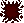
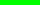
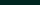
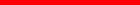
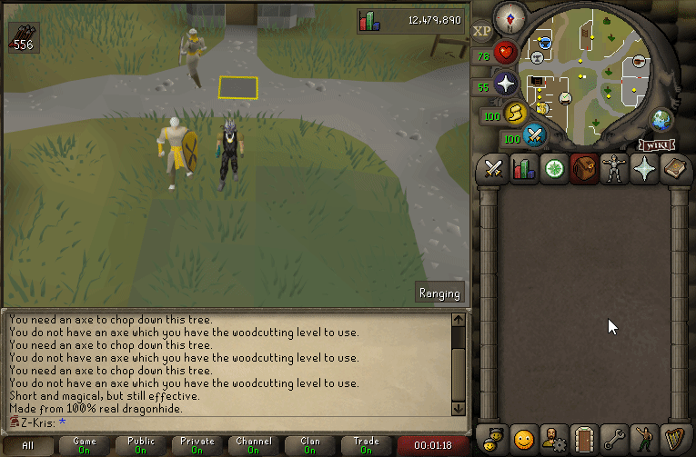
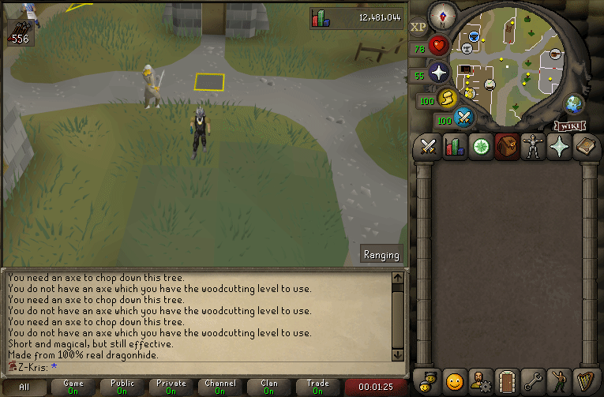
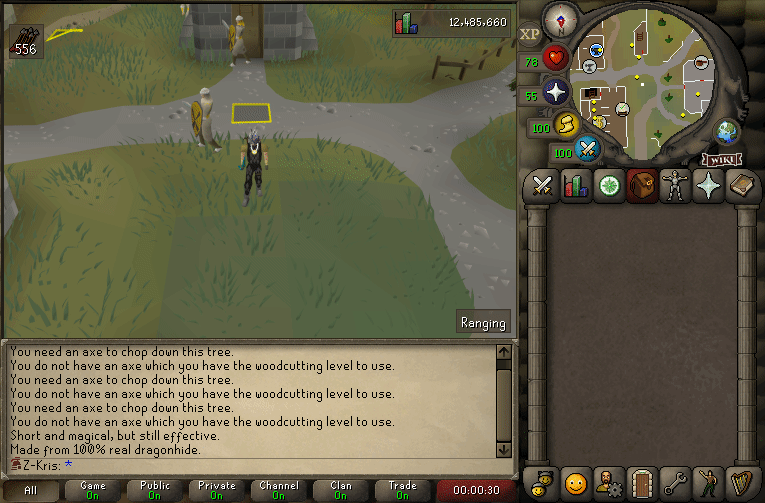

# Hit Mask
{: .no_toc }

Hit mask refers to the updating mask used by both player updating and NPC updating to display
head bars and/or hit splats on an entity. The mask is made up out of two sections - hits splats and head bars.

---

## Table of contents
{: .no_toc .text-delta }

- TOC
{:toc}

---

## Hits

The first half of the mask covers hits. Up to 255 hits can be transmitted to the client per updated entity in
one game tick. While the amount of hits that can be transmitted is quite high, the number of hits that can
render on one entity is capped to the four first ones.

### Supported Variables

The OldSchool RuneScape hit mask is a direct 1:1 match with the one found in today's RuneScape 3.
Because of that, the hits can support a lot more than what they're currently being utilized for in OldSchool RuneScape.
All the variables covered below are written as small short smarts, meaning their minimum value is 0, and the maximum
value is 32,767.
- The type of the hit. The type indicates the config that will be used for the given hit splat.
  - You can read about all the different types of hits in the [hit types](#hit-types) section below.
  - The types 0x7FFF(32,767) and 0x7FFE(32,766) are used to inform the client to read the hit info differently.
  A breakdown of this can be found below in [ways of writing hits](#ways-of-writing-hits).
- The amount displayed on the hit.
- The delay until the hit is rendered. The duration is in [client ticks](../variables/client-tick.md#client-tick).
- Unused variables(They are supported by the mask, but never used in OldSchool RuneScape):
  - Soak type. The type indicates the config that will be used for the soak splat that appears next to the normal hit splat.
  - Soak amount displayed on the soak hit splat.

### Ways of Writing Hits

There are three possible ways to write a hit splat to the client:
- An ignored hit. While the client will appropriately read the hit, it will not process it. The code returns early for this type.
  - Must write the hit type as the value 0x7FFE(32,766). This informs the client that it is about to read an ignored hit.
  - Only the delay is written alongside the ignored hit. Nothing about soaking or the amount is sent.
- A basic hit. This covers all the hits you ever see in OldSchool RuneScape.
  - The hit type written must correspond to the id of the hitmark config.
  - Only the amount and delay are written alongside the basic hits. Soak information is not sent.
- A soaked hit. While this is never used, it is supported:
  - Must write the hit type as the value 0x7FFF(32,767). This informs the client that it's about to read a soaked hit.
  - The actual type of the hit is now written separately, which is followed by the amount shown on the hit splat.
  - The soak hit splat is written afterwards, along with its amount.

### Hit Types
There are two types of hit configs - ones that always display the same sprite, and ones that show a tinted version if the hit was dealt by someone other than yourself.
- [Varbit](../variables/game-variables#varbits)-driven types. These types have two variations of the hit splat - an active and an inactive version.
They all make use of varbit 10,236, which corresponds to the in-game setting "Hitsplat tinting".
If the varbit's value is 0, the inactive version of the hit splat will be shown for the dynamic versions. The always active column indicates
configs which will always display the active icon, regardless of the current value of the given varbit.

| Active Icon | Inactive Icon | Always active id | Dynamic id | Name | Description |
|:-----------:|:-------------:|:----------------:|:----------:|:----:|:-----------:|
|  |  | 12 | 13 | Block | Indicates a hit of zero damage. |
|  |  | 16 | 17 | Damage | Indicates a successful hit that dealt damage. In the [Nightmare Zone](https://oldschool.runescape.wiki/w/Nightmare_Zone), drinking an [absorption potion](https://oldschool.runescape.wiki/w/Absorption#4_dose) will cause all monster-inflicted damage to be zero, but will still use this red damage hit splat to indicate the successful hit. |
|  |  | 18 | 19 | Shield | Indicates damage dealt to [Verzik Vitur's](https://oldschool.runescape.wiki/w/Verzik_Vitur), [The Nightmare's](https://oldschool.runescape.wiki/w/The_Nightmare) and [Tempoross'](https://oldschool.runescape.wiki/w/Tempoross) shields. While the inactive icon is defined in the config, it seems to be a placeholder. The dynamic id is never actually used. |
|  |  | 20 | 21 | Armour | Indicates damage dealt to [Zalcano's](https://oldschool.runescape.wiki/w/Zalcano) stone armour. The dynamic id is never actually used. |
|  |  | 22 | 23 | Charge | Indicates totems being healed while charging them during the fight against [The Nightmare](https://oldschool.runescape.wiki/w/The_Nightmare). |
|  |  | 24 | 25 | Discharge | Indicates totems being damaged while the [parasites](https://oldschool.runescape.wiki/w/Parasite) discharge them during the fight against [The Nightmare](https://oldschool.runescape.wiki/w/The_Nightmare). The dynamic is is never actually used. |

- Always active types. These will always display the same sprite, regardless of whom the hit splat is showing on. As such, they only have one sprite defined.

| Icon |  Id  | Name | Description |
|:----:|:----:|:----:|:-----------:|
|  | 0 | Corruption | [Corruption](https://oldschool.runescape.wiki/w/Corruption_(status)) has a chance to apply on the target of the player who is under the effects of either [Lesser Corruption](https://oldschool.runescape.wiki/w/Lesser_Corruption) or [Greater Corruption](https://oldschool.runescape.wiki/w/Greater_Corruption) during a successful hit. |
|  | 2 | Poison | [Poison](https://oldschool.runescape.wiki/w/Poison) damages entities over time, lowering the damage by one every four hit splat cycles. |
|  | 3 | Unknown | The use case of this hit splat is currently unknown. While it resembles disease rather closely, it is not used for disease in OldSchool RuneScape. |
|  | 4 | Disease | Indicates the player being under the effects of a [disease](https://oldschool.runescape.wiki/w/Disease), which periodically drains stats. |
|  | 5 | Venom | [Venom](https://oldschool.runescape.wiki/w/Venom) damages entities over time, increasing the damage by one every four hit splat cycles, capping out at 20. |
|  | 6 | Heal | Indicates the entity healing for the number shown on the hit splat. |

### Client Code
The below piece of code is a refactored version of the hits section of the hit mask.
Do note that the transformations applied to the `hitCount` variable may differ between the different versions of the client.
```java
hitCount = buffer.readUnsignedByte();
if (hitCount > 0) {
    for (int i = 0; i < hitCount; i++) {
        int soakType = -1;
        int amount = -1;
        int soakedAmount = -1;
        int hitType = buffer.readSmallSmart();
        if (hitType == 0x7FFF) {
            hitType = buffer.readSmallSmart();
            amount = buffer.readSmallSmart();
            soakType = buffer.readSmallSmart();
            soakedAmount = buffer.readSmallSmart();
        } else if (hitType == 0x7FFE) {
            hitType = -1;
        } else {
            amount = buffer.readSmallSmart();
        }
        int delay = buffer.readSmallSmart();
        updatedEntity.applyActorHitsplat(hitType, amount, soakType, soakedAmount, Client.gameCycle, delay);
    }
}
```

## Head Bars

The second half of the hit mask covers head bars. Contrary to popular belief, head bars are not linked to hits themselves. Nothing prevents
the client from showing head bars - or hits for that matter - individually, without the other half. Although up to 255 head bars can be transmitted to the client
per updated entity in one game tick, only the first head bar will actually render.

### Supported Variables

Below is a list of supported variables for head bars. Even though the mask itself is a direct copy of that found in RuneScape 3 today,
only one head bar can display in OldSchool RuneScape. The code responsible for finding the respective current head bar stops at the
very first head bar that is active at the moment, regardless of if it actually matches the one that is being updated.
- The type of the head bar. See types [here](#head-bar-types).
- The time span of the head bar. The number written informs the client to gradually progress the head bar towards the
destination provided further below. Each value corresponds to one [client tick](../variables/client-tick.md#client-tick). If the time span is written as 0x7FFF(32,767),
the head bar will instead be removed instantly. If that's the case, none of the below will be written for this head bar.
- The delay until the head bar becomes visible. The value corresponds to one [client tick](../variables/client-tick.md#client-tick).
- The number of pixels to fill the head bar with.
- If the time span is between 1 and 32,766(inclusive), the number of pixels at which the gradual progression stops.

### Head Bar Types
Below is a table of different head bar types. The types cannot be resized dynamically by the client, and as such,
a lot of duplicate types are made to fill every possible width that might be used.
- The duration variable is the total duration of the head bar in [client ticks](../variables/client-tick.md#client-tick).
- The disposal variable refers to the [client tick](../variables/client-tick.md#client-tick) at which the head bar begins gradually vanishing.
- The width refers to the width of the head bar sprite.

*The table is sorted according to the internal head bar type ids.*

|  Id  | Filled sprite | Empty sprite | Name | Duration | Disposal | Width | Description |
|:----:|:-------------:|:------------:|:----:|:--------:|:--------:|:-----:|:-----------:|
| 0 |  |  | Health | 300 | N/A | 30 | Indicates the current health of the entity. |
| 1 |  |  | N/A | 300 | 280 | 50 | Appears to be unused. |
| 2 |  |  | Health | 300 | 280 | 40 | Indicates the current health of the entity. |
| 3 |  |  | Shield | 300 | 280 | 30 | Indicates the current level of shield for [Verzik Vitur](https://oldschool.runescape.wiki/w/Verzik_Vitur), [The Nightmare](https://oldschool.runescape.wiki/w/The_Nightmare) and [Tempoross](https://oldschool.runescape.wiki/w/Tempoross). |
| 4 |  |  | Shield | 300 | 280 | 40 | Indicates the current level of shield for [Verzik Vitur](https://oldschool.runescape.wiki/w/Verzik_Vitur), [The Nightmare](https://oldschool.runescape.wiki/w/The_Nightmare) and [Tempoross](https://oldschool.runescape.wiki/w/Tempoross). |
| 5 |  |  | Shield | 300 | 280 | 50 | Indicates the current level of shield for [Verzik Vitur](https://oldschool.runescape.wiki/w/Verzik_Vitur), [The Nightmare](https://oldschool.runescape.wiki/w/The_Nightmare) and [Tempoross](https://oldschool.runescape.wiki/w/Tempoross). |
| 6 |  |  | Shield | 300 | 280 | 60 | Indicates the current level of shield for [Verzik Vitur](https://oldschool.runescape.wiki/w/Verzik_Vitur), [The Nightmare](https://oldschool.runescape.wiki/w/The_Nightmare) and [Tempoross](https://oldschool.runescape.wiki/w/Tempoross). |
| 7 |  |  | N/A | 60 | 40 | 100 | Indicates the progress made towards the unfreezing of the [Ice Demon](https://oldschool.runescape.wiki/w/Ice_demon), and feeding of the [Corrupted Scavenger](https://oldschool.runescape.wiki/w/Corrupted_scavenger) in [Chambers of Xeric](https://oldschool.runescape.wiki/w/Chambers_of_Xeric). |
| 8 |  |  | N/A | 60 | 40 | 120 | Indicates the time until the restoration of the [Great Olm's](https://oldschool.runescape.wiki/w/Great_Olm) claws in [Chambers of Xeric](https://oldschool.runescape.wiki/w/Chambers_of_Xeric). |
| 9 |  |  | Shield | 300 | 280 | 80 | Indicates the current level of shield for [Verzik Vitur](https://oldschool.runescape.wiki/w/Verzik_Vitur), [The Nightmare](https://oldschool.runescape.wiki/w/The_Nightmare) and [Tempoross](https://oldschool.runescape.wiki/w/Tempoross). |
| 10 |  |  | Shield | 300 | 280 | 100 | Indicates the current level of shield for [Verzik Vitur](https://oldschool.runescape.wiki/w/Verzik_Vitur), [The Nightmare](https://oldschool.runescape.wiki/w/The_Nightmare) and [Tempoross](https://oldschool.runescape.wiki/w/Tempoross). |
| 11 |  |  | Shield | 300 | 280 | 120 | Indicates the current level of shield for [Verzik Vitur](https://oldschool.runescape.wiki/w/Verzik_Vitur), [The Nightmare](https://oldschool.runescape.wiki/w/The_Nightmare) and [Tempoross](https://oldschool.runescape.wiki/w/Tempoross). |
| 12 |  |  | Shield | 300 | 280 | 70 | Indicates the current level of shield for [Verzik Vitur](https://oldschool.runescape.wiki/w/Verzik_Vitur), [The Nightmare](https://oldschool.runescape.wiki/w/The_Nightmare) and [Tempoross](https://oldschool.runescape.wiki/w/Tempoross). |
| 13 |  |  | Shield | 300 | 280 | 140 | Indicates the current level of shield for [Verzik Vitur](https://oldschool.runescape.wiki/w/Verzik_Vitur), [The Nightmare](https://oldschool.runescape.wiki/w/The_Nightmare) and [Tempoross](https://oldschool.runescape.wiki/w/Tempoross). |
| 14 |  |  | Shield | 300 | 280 | 160 | Indicates the current level of shield for [Verzik Vitur](https://oldschool.runescape.wiki/w/Verzik_Vitur), [The Nightmare](https://oldschool.runescape.wiki/w/The_Nightmare) and [Tempoross](https://oldschool.runescape.wiki/w/Tempoross). |
| 15 |  |  | Armour | 300 | 280 | 30 | Indicates the current level of [Zalcano's](https://oldschool.runescape.wiki/w/Zalcano) shield armour. |
| 16 |  |  | Health | 300 | 280 | 50 | Indicates the current health of the entity. |
| 17 |  |  | Health | 300 | 280 | 60 | Indicates the current health of the entity. |
| 18 |  |  | Health | 300 | 280 | 80 | Indicates the current health of the entity. |
| 19 |  |  | Health | 300 | 280 | 100 | Indicates the current health of the entity. |
| 20 |  |  | Health | 300 | 280 | 120 | Indicates the current health of the entity. |
| 21 |  |  | Health | 300 | 280 | 140 | Indicates the current health of the entity. |
| 22 |  |  | Health | 300 | 280 | 160 | Indicates the current health of the entity. |
| 23 |  |  | Armour | 300 | 280 | 40 | Indicates the current level of [Zalcano's](https://oldschool.runescape.wiki/w/Zalcano) shield armour. |
| 24 |  |  | Armour | 300 | 280 | 50 | Indicates the current level of [Zalcano's](https://oldschool.runescape.wiki/w/Zalcano) shield armour. |
| 25 |  |  | Armour | 300 | 280 | 60 | Indicates the current level of [Zalcano's](https://oldschool.runescape.wiki/w/Zalcano) shield armour. |
| 26 |  |  | Armour | 300 | 280 | 80 | Indicates the current level of [Zalcano's](https://oldschool.runescape.wiki/w/Zalcano) shield armour. |
| 27 |  |  | Armour | 300 | 280 | 100 | Indicates the current level of [Zalcano's](https://oldschool.runescape.wiki/w/Zalcano) shield armour. |
| 28 |  |  | Armour | 300 | 280 | 120 | Indicates the current level of [Zalcano's](https://oldschool.runescape.wiki/w/Zalcano) shield armour. |
| 29 |  |  | Armour | 300 | 280 | 140 | Indicates the current level of [Zalcano's](https://oldschool.runescape.wiki/w/Zalcano) shield armour. |
| 30 |  |  | Armour | 300 | 280 | 160 | Indicates the current level of [Zalcano's](https://oldschool.runescape.wiki/w/Zalcano) shield armour. |
| 31 |  |  | Charge | 300 | 280 | 30 | Indicates the current charge of the totems at [The Nightmare](https://oldschool.runescape.wiki/w/The_Nightmare). |
| 32 |  |  | Charge | 300 | 280 | 40 | Indicates the current charge of the totems at [The Nightmare](https://oldschool.runescape.wiki/w/The_Nightmare). |
| 33 |  |  | Charge | 300 | 280 | 50 | Indicates the current charge of the totems at [The Nightmare](https://oldschool.runescape.wiki/w/The_Nightmare). |
| 34 |  |  | Charge | 300 | 280 | 60 | Indicates the current charge of the totems at [The Nightmare](https://oldschool.runescape.wiki/w/The_Nightmare). |
| 35 |  |  | Charge | 300 | 280 | 80 | Indicates the current charge of the totems at [The Nightmare](https://oldschool.runescape.wiki/w/The_Nightmare). |
| 36 |  |  | Charge | 300 | 280 | 100 | Indicates the current charge of the totems at [The Nightmare](https://oldschool.runescape.wiki/w/The_Nightmare). |
| 37 |  |  | Charge | 300 | 280 | 120 | Indicates the current charge of the totems at [The Nightmare](https://oldschool.runescape.wiki/w/The_Nightmare). |
| 38 |  |  | Charge | 300 | 280 | 140 | Indicates the current charge of the totems at [The Nightmare](https://oldschool.runescape.wiki/w/The_Nightmare). |
| 39 |  |  | Charge | 300 | 280 | 160 | Indicates the current charge of the totems at [The Nightmare](https://oldschool.runescape.wiki/w/The_Nightmare). |
| 40 |  |  | Shield | 300 | 280 | 70 | Indicates the current level of shield for [Verzik Vitur](https://oldschool.runescape.wiki/w/Verzik_Vitur), [The Nightmare](https://oldschool.runescape.wiki/w/The_Nightmare) and [Tempoross](https://oldschool.runescape.wiki/w/Tempoross). |
| 41 |  |  | Armour | 300 | 280 | 70 | Indicates the current level of [Zalcano's](https://oldschool.runescape.wiki/w/Zalcano) shield armour. |
| 42 |  |  | Charge | 300 | 280 | 70 | Indicates the current charge of the totems at [The Nightmare](https://oldschool.runescape.wiki/w/The_Nightmare). |

### Client Code

The below piece of code is a refactored version of the head bars section of the hit mask.
Do note that the transformations applied to the `hitCount`, `fillAmount` and `destinationFillAmount` variables may differ between the different versions of the client.

```java
headbarCount = buffer.readUnsignedByte();
if (headbarCount > 0) {
    for (int i = 0; i < headbarCount; i++) {
        int headbarType = buffer.readSmallSmart();
        int timespan = buffer.readSmallSmart();
        if (timespan == 0x7FFF) {
            updatedEntity.removeHeadbar(headbarType);
        } else {
            int delay = buffer.readSmallSmart();
            int fillAmount = buffer.readUnsignedByte();
            int destinationFillAmount = timespan > 0 ? var0.readUnsignedByte() : fillAmount;
            updatedEntity.updateHeadbar(headbarType, Client.gameCycle, timespan, delay, fillAmount, destinationFillAmount);
        }
    }
}
```

## Media

*The below gif demonstrates sending an individual poison hit splat, without any associated head bars.*


---

*The below gif demonstrates sending an individual head bar without any associated hits.
It also shows the gradual progression from 100% down to 25%, over a time span of 90 [client ticks](../variables/client-tick.md#client-tick).*



---

*The below gif demonstrates sending two hit splats, each with a soak hit splat.
Note that the hit splat shown is configurable for everything. For this demonstration, I've
specifically used the inactive and active versions of the respective hit splats.
The reason behind capping it to two hit splats is due to overlapping. Since OldSchool RuneScape
does not technically support soaking, the positioning of the hit splats is done in a way that
makes any more than two hit splats begin overlapping.*



---

## References
1. [Hitsplat - OS Wikia](https://oldschool.runescape.wiki/w/Hitsplat)